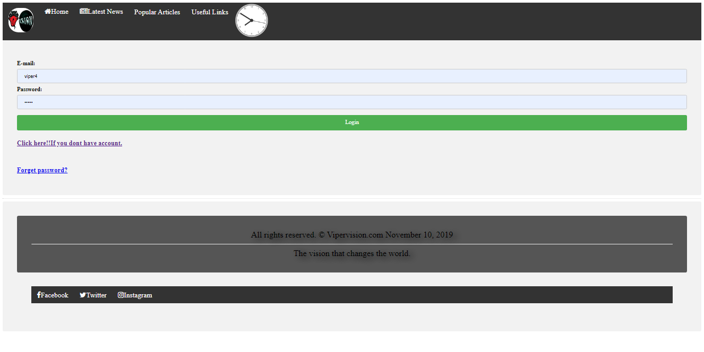
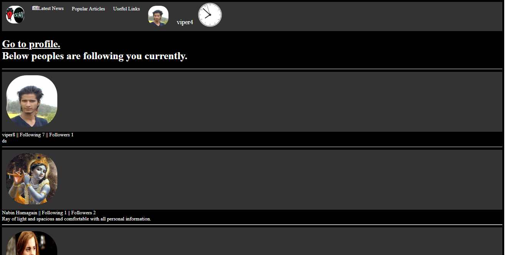
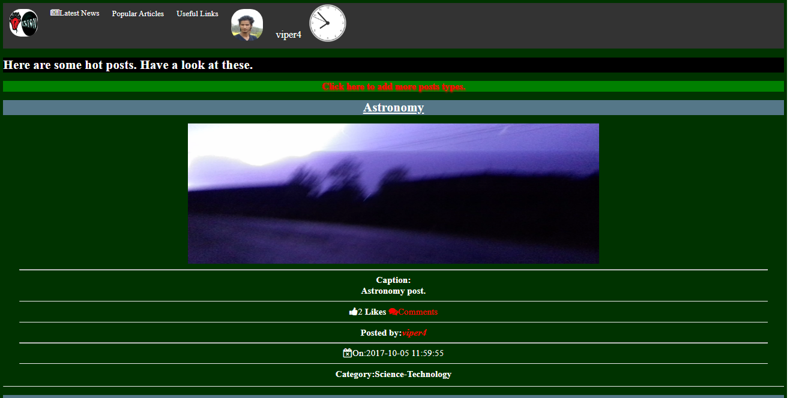
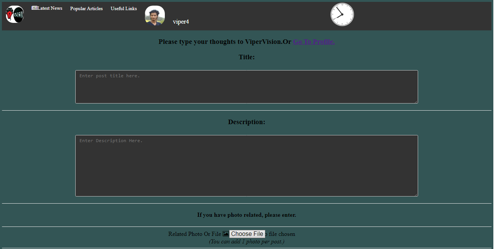
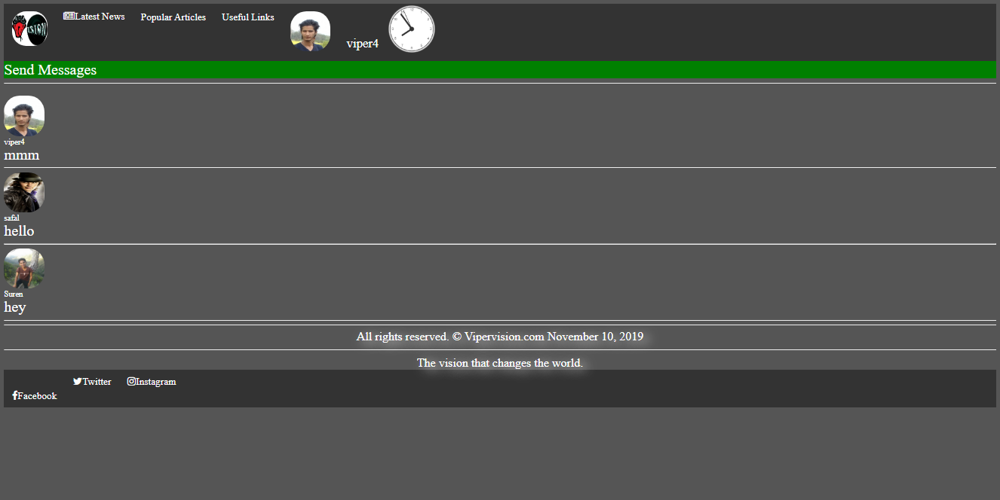
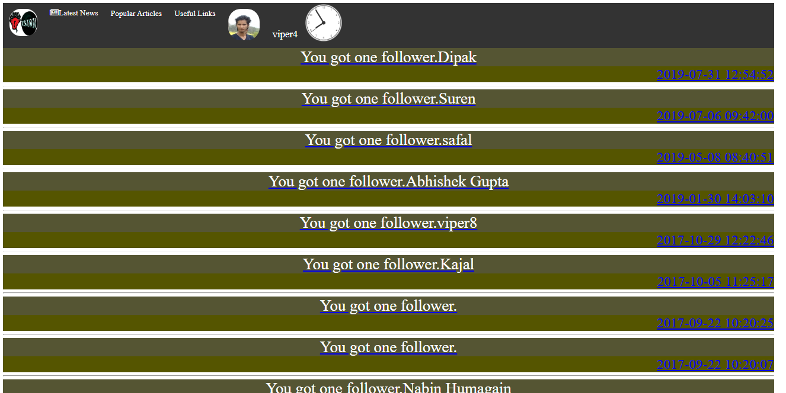
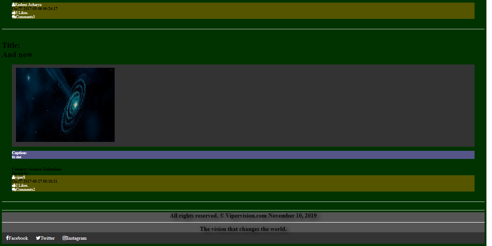

# ViperVision
I began to write this code when i learned just looping on PHP. Then after learning forms, and validations i got an idea, why not build a website for introverts like myself? The year was 2016 when i first got "hello world" from PHP. I then learned slowly because i had no active internet connection. I made a simple social site like website at that time. But due to financial issues i couldn't launch it on web. Then i moved to Cryptography. Then booom i am now AI practitioner.
Some snaps:
## Homepage

